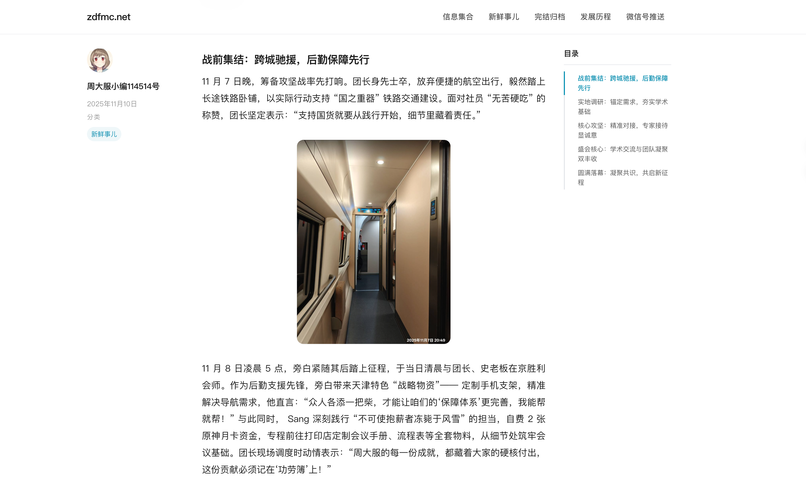

# zdfmc.net

**周大服 Minecraft 社群** —— 一个自 2012 年运行至今的游戏社群网站，2026 年从 WordPress 迁移至 Astro 静态站点。


在线 56 篇文章、9 个分类、554 张附件，全部静态化，部署在 Cloudflare Pages。

## 技术栈

| 层 | 选型 |
|---|---|
| 框架 | [Astro 5](https://astro.build)（hybrid 模式，静态生成 + 按需 SSR） |
| 样式 | [Tailwind CSS 3](https://tailwindcss.com)，自定义 `prose-article` 替代 `@tailwindcss/typography` |
| 部署 | Cloudflare Pages + Workers（`wrangler`） |
| 内容 | 单一 JSON 数据源（`wordpress_data.json`，506 KB），无 CMS |
| 数据迁移 | Python 脚本解析 MySQL dump，清洗 WPBakery 短代码，输出结构化 JSON |
| 图片 | 逐步迁移至 Cloudflare R2（`assets.zdfmc.net`） |
| RSS / Sitemap | `@astrojs/rss` + `@astrojs/sitemap` |

## 项目结构

```
zdfmcnet-astro/
├── src/
│   ├── components/         # HeroBanner, ParticleCanvas, PostCard, TeamGrid 等
│   ├── data/               # wordpress_data.json + 分类/日期索引
│   ├── layouts/            # BaseLayout（全局壳）、PostLayout（三栏文章页）
│   ├── pages/              # 路由：首页、文章详情、分类/日期归档、自定义页面
│   ├── styles/             # global.css（含自定义排版系统）
│   └── content/posts/      # 仅一篇手工 Markdown（重建公告）
├── scripts/                # 数据迁移与发布工具
│   ├── extract_data.py     # MySQL dump → JSON
│   ├── generate_markdown.py
│   ├── publish-post.mjs    # 新文章发布 CLI
│   └── add-post.mjs
├── astro.config.mjs
├── tailwind.config.mjs
└── wrangler.jsonc
```

## 从 WordPress 迁移

整个迁移分为三步：**提取 → 清洗 → 生成**。

### 1. 提取数据

```bash
python3 scripts/extract_data.py
```

该脚本读取 WordPress 的 MySQL dump（`.sql.gz`），直接解析 SQL `INSERT` 语句，提取：

- `wp_posts` — 文章与页面（过滤 `post_status != 'publish'`）
- `wp_terms` / `wp_term_taxonomy` / `wp_term_relationships` — 分类与标签关系
- `wp_postmeta` — 缩略图（`_thumbnail_id`）
- `wp_comments` — 已审核评论

### 2. 清洗内容

WordPress 文章体中残留大量 WPBakery / Visual Composer 短代码，`clean_content()` 函数负责：

- 剥离容器短代码（`[vc_row]`、`[vc_column]` 等），保留内部内容
- `[vc_single_image]` → `<!-- IMG:{id} -->` 占位符，后续由 Markdown 生成器解析为真实 URL
- `[vc_text_separator]` → `<hr>` 或标题
- `[caption]` 解包，保留正文
- 移除所有剩余未识别短代码
- 清理空白段落和 `&nbsp;`

最终输出单一 `wordpress_data.json`，包含全部文章、页面、分类、标签、评论、缩略图、附件 URL。

### 3. 路由保持

原有 WordPress URL 结构完整保留：

| URL 模式 | 说明 |
|---|---|
| `/p/{id}` | 文章详情（纯数字 ID，兼容历史链接） |
| `/p/{slug}` | 文章详情（英文 slug，新文章使用） |
| `/p/category/{slug}` | 分类归档 |
| `/p/category/{slug}/page/{n}` | 分类分页 |
| `/p/date/{yyyy}/{mm}` | 日期归档 |
| `/{slug}` | 自定义页面（含中文 URL 编码路径） |
| `/feed` | RSS 2.0 |

### 4. 发布新文章

```bash
node scripts/publish-post.mjs path/to/post.md [thumbnail-url]
```

Markdown 文件使用 frontmatter 声明元数据（title、date、categories、tags），脚本自动转换为 HTML 并写入 `wordpress_data.json`，同时更新分类索引和日期索引。新文章会自动分配 `/p/{slug}` 和 `/p/{id}` 双 URL。

## Hero 页设计

Hero 区域是网站的视觉核心，承载"第一眼"的社群气质呈现。


**Canvas 粒子背景**：1000 个彩色粒子通过 `ImageData` 直接绘制在 Canvas 上，鼠标移动时粒子会被推开，形成动态、有呼吸感的星空/粒子场效果。粒子颜色取自主题三色强调（青 `#0891b2`、暖红 `#e55c4a`、金 `#d49532`）。

**左侧——看板娘**：社群 mascot 插画大图，绑定鼠标视差效果（`mousemove` 驱动 `translate` 的缓慢跟随）。图片来自原 WordPress 媒体库，标注画师署名。

**右侧——标题区**：
- 渐变文字 "zdfmc.net"（`bg-gradient-to-r from-accent to-accent-warm` + `bg-clip-text`）
- 闪烁光标（`|` 字符，800ms 间隔切换透明度）
- 社群简介文案，引述自创始人 yuge
- 底部迷你数据条：起始于 2012.6、活跃人数 20+、已持续 12 周目

**过渡**：Hero 底部通过 `bg-gradient-to-b from-white to-surface` 自然过渡到后续浅灰背景区域。

整体审美取向：**不追暗色模式**，采用暖白（`#f8f7f4`）基调，强调色克制使用，营造轻松、非正式的社群氛围，而非传统"游戏站"的重色霓虹风格。

## 主页设计

主页由三个区块垂直串联：

### HeroBanner
见上节。

### 新鲜事儿（News Grid）

展示最新 30 篇 `news` 分类文章，响应式网格布局：
- 移动端：单列
- 平板：双列
- 桌面：三列

每篇文章以 **PostCard** 组件呈现——玻璃态卡片（`glass-card`），支持缩略图 hover 缩放，显示最多 2 个分类标签，标题和摘要各限制两行截断。底部提供"查看更多"链接指向分类归档。

### 创世神（Team Grid）

12 位社群成员的网格展示，响应式列数（2/3/4/6 列）。每人圆形头像 + 名字 + 角色描述，hover 时环形边框切换为强调色。

### 设计决策

- **没有暗色模式**：社群气质偏轻松日常，暖白基调比深色更亲和
- **玻璃态卡片**：`bg-surface-light border border-[#e8e4dd] rounded-2xl shadow-sm`，hover 时阴影加深，提供微妙的层次感而非强烈对比
- **无 JS 框架**：全部交互（视差、粒子、TOC 高亮、CJK 自动空格）均为零依赖 vanilla JS，嵌入 `.astro` 组件的 `<script>` 块中

## 中英文混排



中英文混排是中文技术博客的老大难问题。本项目做了三层处理。

### 字体栈

```
sans:  PingFang SC → Microsoft YaHei → Hiragino Sans GB → WenQuanYi Micro Hei → system-ui
serif: Noto Serif SC → STSong → Songti SC → SimSun → Source Han Serif SC
mono:  JetBrains Mono → Fira Code → SF Mono
```

中文优先，西文 fallback 交给系统。中文字体不区分 sans/serif 的惯例在这里被打破——正文使用 sans（PingFang SC），但保留了 serif 栈供特殊场景。

### 自定义文章排版（prose-article）

**不使用 Tailwind Typography 的 `prose` 类**，原因：

1. `prose` 的西文排版预设（`font-size: 1.125rem`、窄 `line-height`）对中文不友好，中文字符需要更大的行高和更克制的字号
2. `prose` 的颜色/间距基于西方设计体系，在中文长文本中显得局促
3. 需要精确控制每个元素以适应 WordPress 迁移内容的遗留内联样式

自建 `prose-article` 的核心参数：

| 属性 | 值 | 理由 |
|---|---|---|
| `font-size` | `1.0625rem`（17px） | 比西文正文字号稍小，中文笔画密度高，同字号视觉更"满" |
| `line-height` | `1.85` | CJK 字符无升部/降部，需要更大行高维持呼吸感 |
| `text-align` | `justify` | 中文两端对齐天然美观，几乎不出现西文 justify 的河流效应 |
| `max-width` | `40rem`（640px） | 中文每行约 35-40 字，符合可读性最佳实践 |
| `word-break` | `break-all` + `overflow-wrap: break-word` | 防止长 URL 或连续英文字符串撑破布局 |

### CJK-Latin 自动空格

文章加载后，`PostLayout` 中的 `autoSpace()` 函数遍历文章 DOM 树中的所有文本节点，在 CJK 字符与拉丁字符之间自动插入空格：

```js
// "WordPress不行了" → "WordPress 不行了"
reCJK  = /([一-鿿…])([a-zA-Z0-9])/g   // 中文后接英文
reLatin = /([a-zA-Z0-9])([一-鿿…])/g   // 英文后接中文
```

跳过 `<code>`、`<pre>`、`<script>`、`<style>` 节点，避免破坏代码块。

这样做的好处是不需要构建期处理（Markdown 内容保持原样），也不依赖额外库（如 `pangu.js`）。几十行代码，零依赖。

### 三栏文章布局（桌面端）

```
┌──────────┬─────────────────────┬──────────┐
│  180px   │      minmax(0,1fr)  │  200px   │
│  元信息   │      正文内容        │  目录    │
│  作者     │                     │  (TOC)   │
│  日期     │                     │          │
│  分类     │                     │          │
│  标签     │                     │          │
│ (sticky)  │                     │ (sticky) │
└──────────┴─────────────────────┴──────────┘
```

- 左侧栏和右侧目录均为 `position: sticky`，随滚动固定
- 目录通过 `IntersectionObserver` 高亮当前阅读位置
- `<1024px` 时退化为单栏布局，元信息内联显示，目录折叠为 `<details>`
- 目录少于 2 个条目时自动隐藏

### 覆盖 WordPress 遗留样式

迁移内容中残留大量 `span[style]` 内联样式，通过 CSS 强制覆盖：

```css
.prose-article span[style]           { font-weight: inherit !important; }
.prose-article span[style*="color"]  { color: inherit !important; }
```

## 开发

```bash
cd zdfmcnet-astro
npm install
npm run dev        # astro dev
npm run build      # astro build
npm run deploy     # astro build + wrangler deploy
```

## 许可

网站源码以 MIT 协议开源。文章内容和插画版权归原作者所有。
